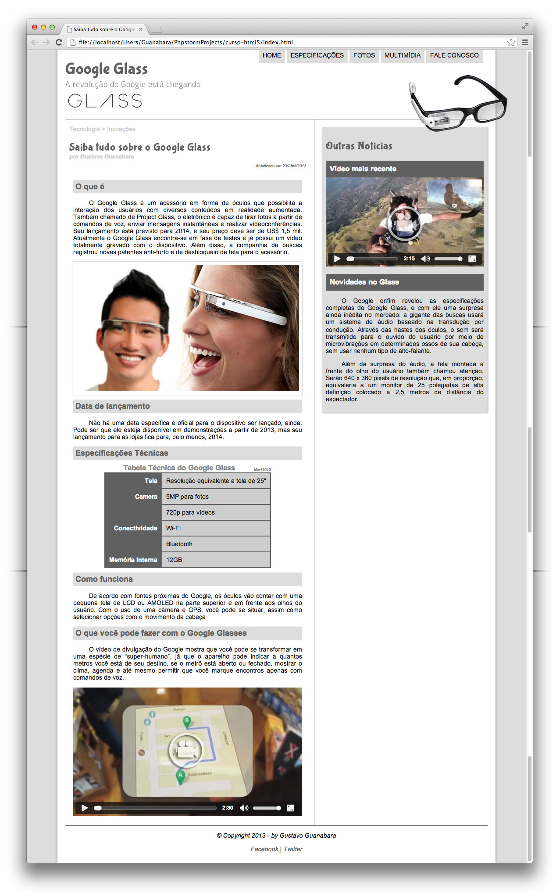
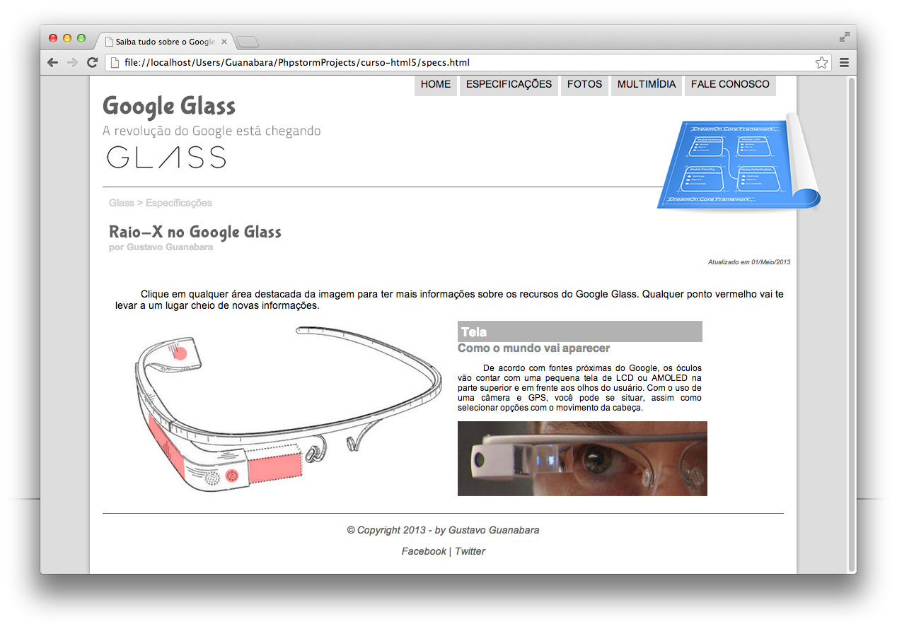
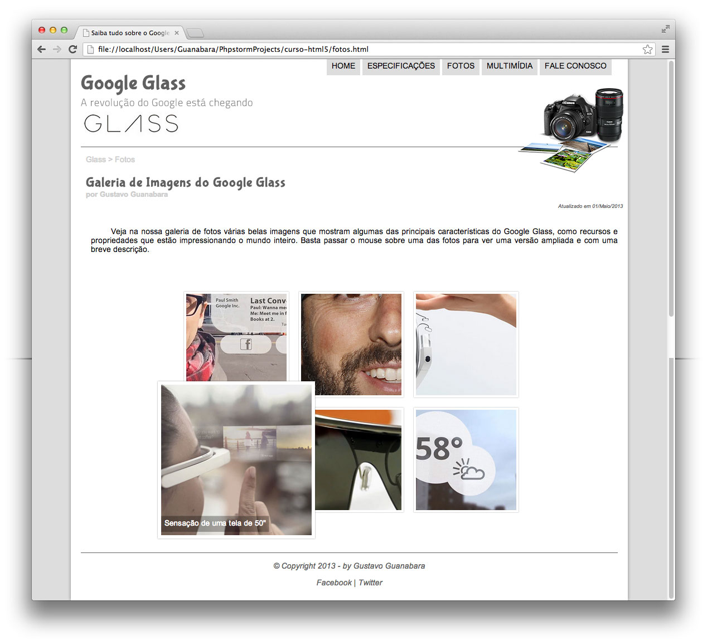
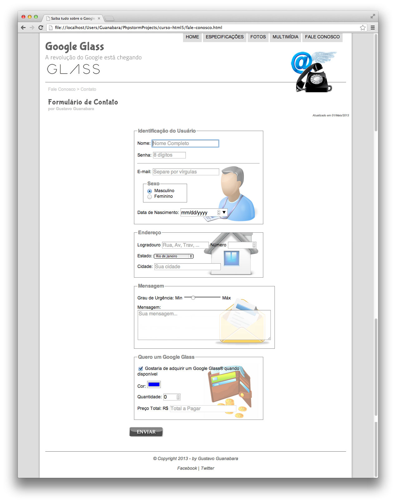

# Copy GoogleGlass website
## About:

This repository is an extend copy of an educational project from CursoEmVideo.com, with the goal of teaching the front-end fundamentals.

**Stacks:**
- HTML
- CSS
- JavaScript

### Screeshots of project:

<ol>
    <li>
    <figure>
        
    </figure>
    </li>
    <li>
    <figure>
        
    </figure>
    </li>
    <li>
    <figure>
        
    </figure>
    </li>
    <li>
    <figure>
        
    </figure>
    </li>
    <li>
    <figure>
        
    </figure>
    </li>
</ol>